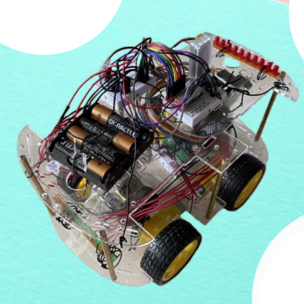
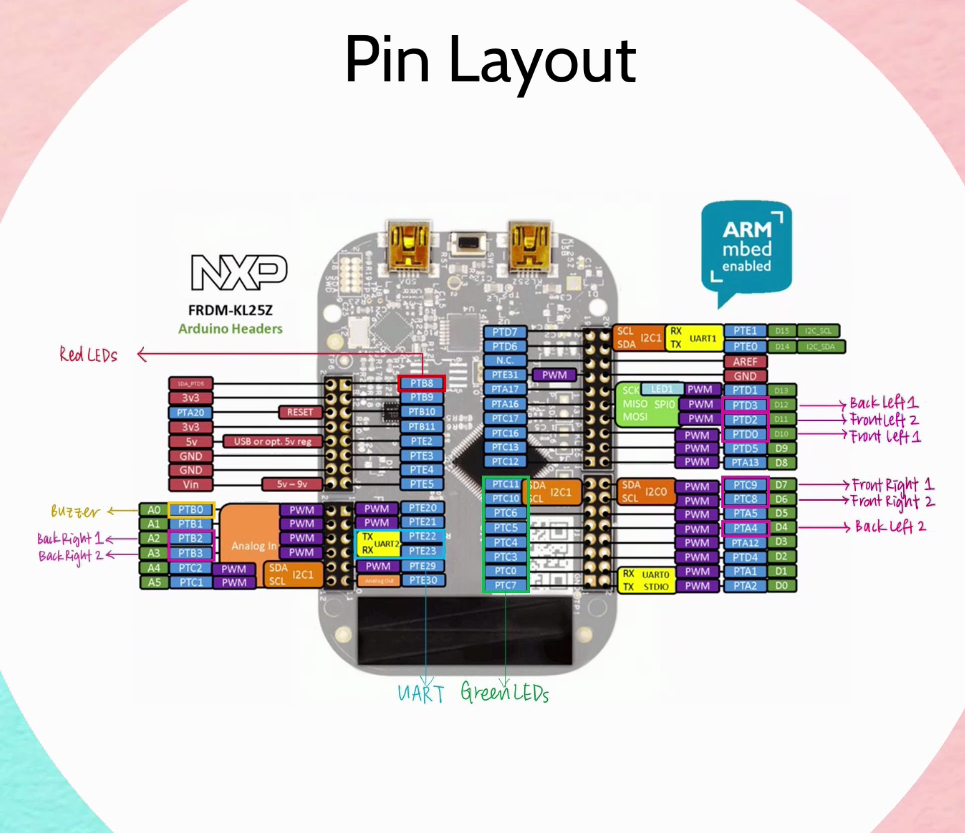
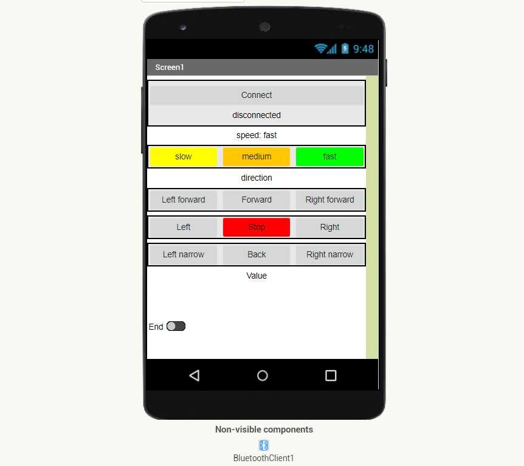

# RTOS-robot
A robot built using the FRDM-KL25Z board, coded in C

## Description
Features
* A light, sound, motor, and bluetooth communication system
* Multi-threading 
* A mobile application to control the robot remotely

## Hardware

## Mobile application

